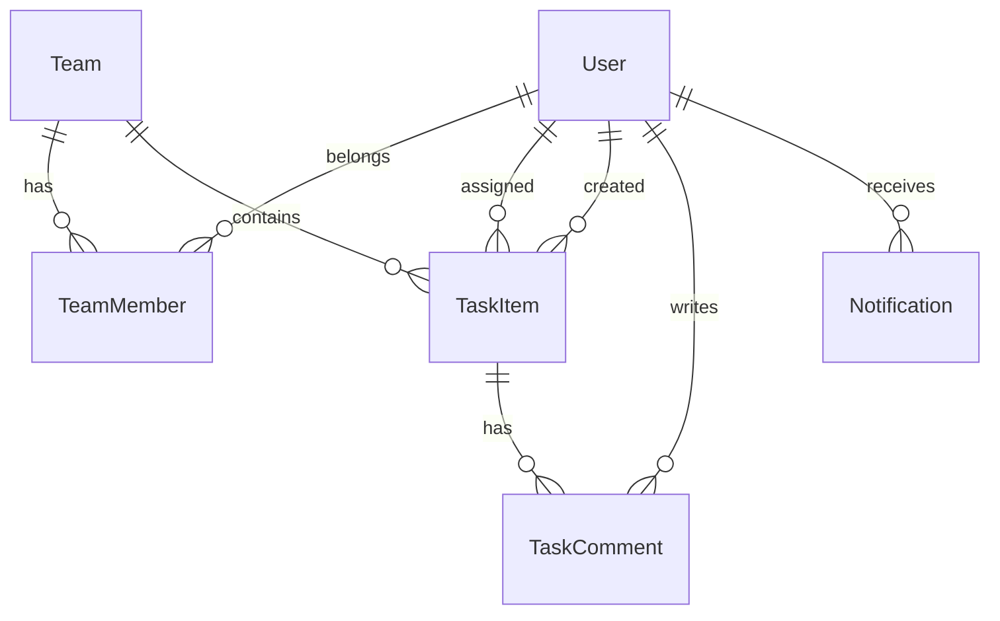

# Team Task Management System — Project Plan

> **Source:** [Dot Net Assignment_Task_Management_System_Project.pdf](../Dot%20Net%20Assignment_Task_Management_System_Project.pdf)  
> **Repository:** `Management-System` (monorepo)  
> **Last updated:** September 2026

This document is the implementation roadmap for the **role-based full-stack Task Management System** assessment. It maps assignment requirements to this repo’s layout (`Management-System-Backend`, `Management-System-Frontend`) and defines phases, deliverables, and evaluation alignment.

---

## 1. Assignment summary

Build a **role-based Task Management System** where organizations can:

- Manage **teams**
- **Assign tasks** and track progress (**To Do**, **In Progress**, **Done**)
- **Collaborate** via task **comments**
- **Notify** users on assignment and status changes

| Role    | Capabilities                                      |
|---------|---------------------------------------------------|
| Admin   | Manage teams; assign tasks to managers and users |
| Manager | Create tasks; assign tasks to team members       |
| User    | View and manage assigned tasks                   |

**Assessment goal:** Design, implement, secure, test, document, and deploy a production-oriented full-stack application.

---

## 2. Current repository state

| Area              | Status |
|-------------------|--------|
| Backend skeleton  | .NET 8, Clean Architecture (Domain, Application, Infrastructure, Api), Swagger in Development |
| Domain / features | **Phase 0:** domain entities + EF schema; API features in Phase 1+ |
| Database / EF Core| **Done (Phase 0):** EF Core SqlServer, migrations, seed on dev startup — **Azure SQL** `TaskManagementDb` on `sql-taskmgmt-karan` (South India) |
| Auth (JWT + RBAC) | **Done (Phase 1):** login, register, JWT bearer, role policies, Swagger auth |
| Tasks / comments / notifications / dashboard | **Done (Phases 3–4):** task CRUD, comments, in-app notifications API, dashboard summary |
| Frontend          | Placeholder only — assignment requires **React + Axios** |
| Docker / CI/CD    | Not set up yet |

**Strategic choice:** **.NET 8 + EF Core + Azure SQL Server**; **React (Vite) + Axios** for frontend. Connection string via User Secrets locally and App Service settings in production.

---

## 3. Target architecture

```text
Management-System/
├── docs/
│   └── PROJECT_PLAN.md          ← this file
├── Management-System-Backend/
│   └── src/
│       ├── ManagementSystem.Domain/        # Entities, enums, domain rules
│       ├── ManagementSystem.Application/   # DTOs, services, interfaces, validators
│       ├── ManagementSystem.Infrastructure/# EF Core, JWT, email/mock notifications
│       └── ManagementSystem.Api/           # Controllers, middleware, auth pipeline
├── Management-System-Frontend/             # React + Axios SPA
├── docker-compose.yml                      # (bonus) API + DB + optional frontend
└── .github/workflows/                      # (bonus) CI/CD
```

### 3.1 Backend layering (Clean Architecture)

| Layer            | Responsibility |
|------------------|----------------|
| **Domain**       | `User`, `Team`, `TeamMember`, `TaskItem`, `TaskComment`, `Notification`; enums `TaskStatus`, `TaskPriority`, `UserRole` |
| **Application**  | Use cases: auth, teams, tasks, comments, dashboard queries; authorization policies per role |
| **Infrastructure** | `DbContext`, migrations, `IPasswordHasher`, JWT issuance, `IEmailSender` or mock notifier |
| **Api**          | REST controllers, global exception handler, FluentValidation (or DataAnnotations), Swagger + JWT scheme |

### 3.2 Frontend structure (React)

```text
src/
├── api/              # Axios instance, interceptors (token, 401 refresh/logout)
├── auth/             # Login, register (if exposed), protected routes
├── pages/            # Dashboard, Tasks, Teams, Task detail
├── components/       # TaskCard, StatusBadge, CommentList, Filters
├── hooks/            # useAuth, useTasks
└── routes/           # Role-aware navigation
```

---

## 4. Database design (relational)

### 4.1 Core entities

| Entity        | Key fields / notes |
|---------------|--------------------|
| **User**      | Id, Email (unique), PasswordHash, FullName, Role (`Admin`, `Manager`, `User`), CreatedAt |
| **Team**      | Id, Name, Description, CreatedByUserId |
| **TeamMember**| TeamId, UserId, JoinedAt (unique TeamId + UserId) |
| **TaskItem**  | Id, Title, Description, Status, Priority, DueDate, AssigneeId, CreatedById, TeamId (optional), CreatedAt, UpdatedAt |
| **TaskComment** | Id, TaskId, AuthorId, Body, CreatedAt |
| **Notification** | Id, UserId, Type, Message, RelatedTaskId, IsRead, CreatedAt (supports mock in-app notifications) |

### 4.2 Relationships (high level)



### 4.3 Indexing & constraints

- Unique index on `User.Email`
- Foreign keys with appropriate delete behavior (e.g. restrict delete on User if tasks exist, or soft-delete users)
- Index on `TaskItem(AssigneeId, Status)`, `TaskItem(DueDate)`, `TaskItem(Priority)` for dashboard filters

---

## 5. Authentication & authorization

### 5.1 Authentication

- **JWT** access tokens (assignment allows JWT or OAuth; JWT is simplest for SPA)
- **BCrypt / ASP.NET Identity PasswordHasher** for password hashing
- Register + login endpoints; optional seed users for demo
- Token expiration (e.g. 60 minutes) + clear **401** handling on frontend

### 5.2 Role-based access control (RBAC)

| Action                         | Admin | Manager | User |
|--------------------------------|:-----:|:-------:|:----:|
| Manage all teams               | ✓     | —       | —    |
| Add/remove team members        | ✓     | ✓*      | —    |
| Create task                    | ✓     | ✓       | —    |
| Assign task to any org user    | ✓     | ✓**     | —    |
| Update own assigned task status| ✓     | ✓       | ✓    |
| Comment on accessible tasks    | ✓     | ✓       | ✓    |
| View dashboard (scoped)        | all   | team    | own  |

\* Manager: teams they manage (define rule: Manager is `TeamMember` with role flag, or `Team.ManagerId`).  
\** Manager: assign only within their team(s).

Implement via **ASP.NET Core Authorization policies** + service-layer checks (never trust client role alone).

---

## 6. REST API plan

Base path: `/api/v1` (optional versioning). All protected routes require `Authorization: Bearer {token}`.

### 6.1 Auth

| Method | Endpoint           | Description |
|--------|--------------------|-------------|
| POST   | `/auth/register`   | Register (optional: Admin-only in production; open for demo if assignment requires registration) |
| POST   | `/auth/login`      | Returns JWT + user profile + role |
| GET    | `/auth/me`         | Current user |

### 6.2 Teams

| Method | Endpoint                    | Roles        |
|--------|-----------------------------|--------------|
| GET    | `/teams`                    | Admin, Manager |
| POST   | `/teams`                    | Admin        |
| PUT    | `/teams/{id}`               | Admin        |
| POST   | `/teams/{id}/members`       | Admin, Manager |
| DELETE | `/teams/{id}/members/{userId}` | Admin, Manager |

### 6.3 Tasks

| Method | Endpoint              | Notes |
|--------|-----------------------|-------|
| GET    | `/tasks`              | Query: `status`, `priority`, `dueBefore`, `dueAfter`, `assigneeId`, `teamId` |
| GET    | `/tasks/{id}`         | Detail + comments |
| POST   | `/tasks`              | Admin, Manager |
| PUT    | `/tasks/{id}`         | Update fields / assignee |
| PATCH  | `/tasks/{id}/status`  | Status transition; triggers notification |
| DELETE | `/tasks/{id}`         | Admin, Manager (optional) |

### 6.4 Comments

| Method | Endpoint                    |
|--------|-----------------------------|
| GET    | `/tasks/{id}/comments`      |
| POST   | `/tasks/{id}/comments`      |

### 6.5 Dashboard & notifications

| Method | Endpoint                      |
|--------|-------------------------------|
| GET    | `/dashboard/summary`          | Counts by status for current user scope |
| GET    | `/notifications`              | List for current user |
| PATCH  | `/notifications/{id}/read`    | Mark read |

### 6.6 API quality (required)

- Request validation with meaningful **400** responses
- Consistent error envelope (e.g. `{ "title", "status", "errors" }`)
- **403** for forbidden role actions
- Swagger documented with JWT security scheme

---

## 7. Notifications

**Required events:**

1. Task assigned to a user  
2. Task status updated (notify assignee and optionally creator)

**Implementation options:**

| Option | When to use |
|--------|-------------|
| **Mock / in-app** | Store rows in `Notification`; show bell dropdown in UI — acceptable per assignment |
| **Email (SMTP)**  | Bonus realism; use `IEmailSender` + dev sink (Mailhog) in Docker |

Trigger notifications in **Application layer** after successful save (domain event or explicit call from task service).

---

## 8. Frontend UX plan

### 8.1 Pages

| Page            | Purpose |
|-----------------|---------|
| Login / Register| Auth flows with error messages from API |
| Dashboard       | Status overview cards; filters by deadline, status, priority |
| Tasks list      | Table/cards with filters; role-based create button |
| Task detail     | Status control, assignee, comments thread |
| Teams (Admin/Manager) | CRUD teams, manage members |

### 8.2 UX requirements

- Responsive layout (mobile-friendly — bonus criteria)
- Loading and empty states
- Accessible forms (labels, focus, contrast)
- Axios interceptor: attach token; on **401** redirect to login

---

## 9. Implementation phases

### Phase 0 — Foundation (1–2 days)

- [x] Choose database: **Azure SQL Server** (`TaskManagementDb` / `sql-taskmgmt-karan`)
- [x] Add EF Core packages to Infrastructure; `ApplicationDbContext`
- [x] Initial migration + seed data (Admin, Manager, User sample accounts)
- [x] Update root and backend README with connection strings (User Secrets — no passwords in repo)

### Phase 1 — Auth & RBAC (2–3 days)

- [x] User entity (persistence); [x] registration/login API
- [x] JWT generation and validation middleware
- [x] Role policies on controllers
- [x] Swagger JWT configuration

**Exit criteria:** Login from Swagger/Postman; role-protected endpoint returns 403 for wrong role.

### Phase 2 — Teams & users (2 days)

- [x] Team CRUD (Admin)
- [x] Team membership (Admin/Manager rules)
- [x] List users for assignment dropdowns (scoped)

### Phase 3 — Tasks & comments (3–4 days)

- [x] Task CRUD + status enum
- [x] Assignment rules by role
- [x] Comments API
- [x] Notification records on assign + status change

### Phase 4 — Dashboard API (1 day)

- [x] Aggregated counts and filtered task lists for dashboard

### Phase 5 — React frontend (4–5 days)

- [ ] Vite + React + TypeScript in `Management-System-Frontend`
- [ ] Axios client, auth context, protected routes
- [ ] Dashboard, tasks, task detail, teams (role-gated)
- [ ] CORS on API for dev origin

### Phase 6 — Quality & DevOps (3–4 days, overlaps possible)

- [ ] Unit tests: Application services (auth rules, task assignment)
- [ ] Integration tests: WebApplicationFactory + Testcontainers or in-memory DB
- [ ] `docker-compose.yml`: API + DB (+ Mailhog optional)
- [ ] GitHub Actions: build, test, optional deploy
- [ ] Deploy: API (Railway/Render), frontend (Netlify/Vercel)

### Phase 7 — Deliverables (1–2 days)

- [ ] README: setup, env vars, **sample credentials**, stack list
- [ ] Swagger live + exported Postman collection (either is acceptable)
- [ ] 5–8 minute Loom/Drive walkthrough
- [ ] Optional live demo URLs in README

**Suggested total duration:** 2–3 weeks part-time (adjust with extension request if needed).

---

## 10. Testing strategy (10 evaluation points)

| Type | Focus |
|------|--------|
| **Unit** | Password hashing; RBAC helpers; task status transitions; “Manager cannot assign outside team” |
| **Integration** | Login → create task → assign → comment → status change → notification created |
| **Manual** | Swagger + UI flows for all three roles |

Tools: **xUnit**, **FluentAssertions**, **Moq** (unit); **Microsoft.AspNetCore.Mvc.Testing** (integration).

---

## 11. DevOps & deployment (10 evaluation points)

| Item | Plan |
|------|------|
| Docker | Multi-stage Dockerfile for Api; compose with PostgreSQL |
| CI | GitHub Actions: `dotnet restore`, `build`, `test` on push/PR |
| CD | Optional deploy backend to Railway/Render; frontend to Vercel/Netlify |
| Secrets | User secrets / GitHub secrets — never commit connection strings or JWT keys |

---

## 12. Documentation & presentation (10 evaluation points)

| Deliverable | Location / action |
|-------------|-------------------|
| Setup guide | Root `README.md` + backend `README` if needed |
| Sample credentials | README table (seeded users) |
| API docs | Swagger at `/swagger` + optional `docs/postman/` collection |
| Architecture | This file + optional diagram in README |
| Video | 5–8 min: auth, roles, task flow, comments, notifications, demo deploy |

---

## 13. Evaluation criteria mapping

| Section | Points | How this plan addresses it |
|---------|--------|------------------------------|
| Backend API Design & Auth | 20 | REST + JWT + RBAC policies + validation + error handling |
| Database Design & Relations | 15 | Normalized schema, FKs, indexes, EF migrations |
| Frontend UI & UX | 15 | React dashboard, filters, responsive layout |
| Role-Based Access & Logic | 10 | Policy matrix + service-layer enforcement |
| Code Quality & Modularity | 10 | Clean Architecture already started; keep thin controllers |
| Testing | 10 | Unit + integration tests in Phase 6 |
| DevOps | 10 | Docker compose + GitHub Actions + deploy |
| Documentation & Presentation | 10 | README, Swagger/Postman, video walkthrough |
| **Total** | **100** | |

---

## 14. Sample seed credentials (for README — implement in Phase 0)

| Role    | Email              | Password (example) |
|---------|--------------------|--------------------|
| Admin   | admin@demo.com     | `Admin@123`        |
| Manager | manager@demo.com   | `Manager@123`      |
| User    | user@demo.com      | `User@123`         |

Use only for local/demo environments; document that passwords must be changed in production.

---

## 15. Risks & mitigations

| Risk | Mitigation |
|------|------------|
| Scope creep | Stick to assignment features first; bonus items after core demo works |
| RBAC bugs | Centralize authorization in Application services; integration tests per role |
| CORS / token issues | Configure CORS early when starting React |
| Deadline pressure | Complete Phases 0–4 + minimal UI first, then polish and DevOps |

---

## 16. Definition of done (MVP for submission)

- [ ] Three roles work end-to-end in UI and API  
- [ ] Tasks: create, assign, statuses **To Do / In Progress / Done**  
- [ ] Teams and membership (Admin/Manager rules)  
- [ ] Comments on tasks  
- [ ] Notifications (mock or email) on assign and status update  
- [ ] Dashboard with filters (deadline, status, priority)  
- [ ] README + Swagger or Postman + video  
- [ ] Tests and Docker/CI present for bonus marks  

---

## 17. Related files

- Assignment PDF: [`Dot Net Assignment_Task_Management_System_Project.pdf`](../Dot%20Net%20Assignment_Task_Management_System_Project.pdf)
- Monorepo overview: [`README.md`](../README.md)
- Backend solution: [`Management-System-Backend/ManagementSystem.sln`](../Management-System-Backend/ManagementSystem.sln)
- Frontend placeholder: [`Management-System-Frontend/README.md`](../Management-System-Frontend/README.md)
